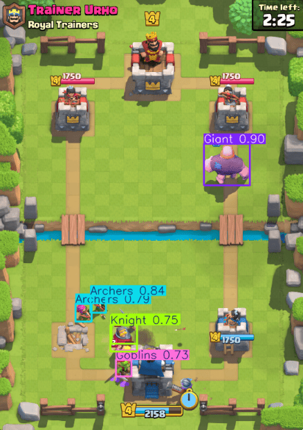

# CRBot

A Clash Royale bot for BlueStacks that reads the game screen with computer vision (elixir, hand cards, troops, crowns, match state) and plays using a DQN reinforcement learning agent trained on real matches.

> **⚠️ Disclaimer:** This project does **not** adhere to Clash Royale / Supercell's Terms of Service around automation. It was built purely as a learning project — computer vision, reinforcement learning, and screen automation — and was tested in practice matches. Use at your own risk; I'm not responsible for anything that happens to an account this is run on.

Inspired by [this video by JuniorBuilds](https://www.youtube.com/watch?v=6Gm-pnNieMU), which got me started on the idea.



## Overview

The bot has two halves:

1. **Sensing** — a set of computer-vision modules that read the live game screen (no access to any internal game state/API) and turn it into structured data: current elixir, what's in your hand, what troops are on the board and where, current crown counts, and whether a match has just ended.
2. **Deciding** — a DQN (Deep Q-Network) reinforcement learning agent (via [Stable Baselines 3](https://stable-baselines3.readthedocs.io/)) that takes that sensed state and decides which card to play and where, trained entirely through trial and error against real matches.

## How It Works

### Sensing

| Module | What it reads | How |
|---|---|---|
| `elixir.py` | Current elixir (0-10) | Pixel-color counting on the elixir bar (see deep-dive below) |
| `classify.py` | Hand cards + affordability | Screenshots the hand region, splits into 4 cards, classifies each with a YOLO classification model |
| `detect.py` | Troops on the board | YOLO object detection model on a live screen capture, returns each troop's type/position/confidence |
| `crowns.py` | Crown counts (both sides) | Samples fixed pixel positions in the crown-slot HUD, matches against known colors |
| `match_end.py` | Whether a match just ended | Template-matches the "Battle"/"OK" button images against a fixed screen region, and drives the post-match click-through (skip chests, handle the reward ladder, queue the next battle) |

`card_data.py` just holds a static dictionary of each card's elixir cost.

#### Elixir Detection Deep-Dive

The bot needs to know how much elixir the player currently has so it does not attempt to play cards without enough resources. A simpler approach would have been to check a single representative pixel per elixir level — e.g. if the pixel at the level-2 marker is purple, elixir = 2. Instead, the approach documented below counts *every* purple pixel across the whole elixir bar region and thresholds the total count, which is more thorough but also more work than it needed to be.

First, a small rectangular region is captured as a screenshot that contains only the elixir bar. This region is adjusted for my screen and can be modified if needed. Then, purple pixels are detected in the screenshot. As the filled part of the elixir bar is purple, a target purple color is defined to detect the pixels: `PURPLE_COLOR = [208, 33, 214]` with a tolerance value `TOLERANCE = 80`. This tolerance value allows some difference between the pixel colors and the target color to make detection still work if there are minor color variations. Each pixel in the screenshot is compared to this target purple color, for example:
```
Pixel: [200, 50, 220]
Target: [208, 33, 214]

Difference:
|200-208| = 8
|50-33|  = 17
|220-214|= 6

So:
diff = [8, 17, 6]
```
This compares every pixel to the target purple. After this, each pixel is checked if it's within tolerance in R, G, and B channels. This creates a True/False mask:
```
For each pixel, if:
Red difference ≤ tolerance
AND
Green difference ≤ tolerance
AND
Blue difference ≤ tolerance
Then:
True (purple pixel)
Otherwise:
False
```
So the result is a boolean mask: `[True, True, False, True, ...]` The True values are counted which is the sum of purple pixels. This gives the total number of purple pixels in the elixir bar. Based on testing, the number of purple pixels was measured for each elixir level from 0 to 10, and from those measurements threshold values were created. For example, if purple pixels < 223 (the first threshold value) -> elixir=0. If between 223 and 544 (first and second threshold values) -> elixir=1, and so on. This converts the pixel count into an integer elixir value from 0 to 10.

There is one special case that needs to be handled. When the elixir reaches ten, the game briefly shows a pink "Elixir bar is full" message over the bar which messes up the purple pixel count. During this moment the number of purple pixels drops and pink pixels increase. To prevent this the code also checks for the pink color associated with the full elixir message. If enough pink pixels are detected, the system immediately returns an elixir value of ten regardless of the purple pixel count.

### Acting

`action.py` is the only module that touches the mouse. `play_card(slot, x, y)` clicks the hand slot, then clicks the target position — but only if that position is inside `ARENA_BOUNDS` (currently only your own half of the arena; see [Known Limitations](#known-limitations)).

### Reinforcement Learning

| Module | Role |
|---|---|
| `tracker.py` | Tracks troops frame-to-frame (since `detect.py` has no memory between calls) — matches new detections to existing troops by proximity, classifies ally/enemy by which side of the arena they appeared on, and detects deaths after a few consecutive missed frames |
| `reward.py` | Turns game events into a scalar reward: +8 per crown gained, -8 per crown lost, +0.1 per enemy troop killed, ±15 at match end for a win/loss (a draw counts as a loss) |
| `env.py` | A [Gymnasium](https://gymnasium.farama.org/) environment (`ClashRoyaleEnv`) that wires all of the above into a standard `reset()`/`step()` interface — 97 possible actions (play 1 of 4 cards at 1 of 24 grid positions, or do nothing), an 87-value observation (elixir, crowns, hand, up to 20 tracked troops) |
| `agent.py` | The training script — builds a `DQN` model via Stable Baselines 3 and trains it against `ClashRoyaleEnv`, with checkpointing (model + replay buffer) so a training run can be safely paused and resumed across sessions |

## Known Limitations

- **Detection isn't perfect.** New cards and variants (heroes, evolutions) get released fairly often, and the training dataset doesn't include them — it also struggles to identify some existing cards reliably even without that. The dataset also doesn't differentiate ally vs. enemy troops (they're visually identical), so `tracker.py` instead uses a positional heuristic (which side of the arena a troop first appeared on) rather than relying on the classifier for that distinction.
- **Tower health isn't detected** — the bot only knows about full tower destruction (crowns), not partial damage.
- **The bot can only place troops on its own half of the arena.** `ARENA_BOUNDS` is a fixed region and never expands after taking a princess tower, even though the real game opens up placement on the enemy's side once a tower falls. This is because there's currently no detection for *which* princess tower (left/right) was destroyed.

## Getting Started

### Prerequisites

- Windows, with [BlueStacks](https://www.bluestacks.com/) running Clash Royale
- Python 3.12
- An NVIDIA GPU is strongly recommended (training/inference was done on an RTX 4060) — YOLO and DQN training are slow on CPU

### 1. Clone and install dependencies

```bash
git clone <this-repo-url>
cd CRBot
python -m venv .venv
.venv\Scripts\activate
pip install -r requirements.txt
```
`requirements.txt` installs a CPU-only PyTorch by default — see the comment at the top of that file for the CUDA install command if you have an NVIDIA GPU.

### 2. Get the training data

The card-classification and troop-detection datasets aren't included in this repo (too large, and gitignored) — but `dataset/deck/` and `dataset/troops/` already exist as empty placeholder folders after cloning, so you don't need to create them yourself. They're published on Roboflow:

- **Cards / deck classification**: [cards-clash-royale](https://universe.roboflow.com/my-workspace-0qlfe/cards-clash-royale-khffw) — images resized to 224×224, with a small random-brightness augmentation (±15%) applied to create 3 versions of each source image.
- **Troops / detection**: [clash-royale troop detection](https://universe.roboflow.com/my-workspace-0qlfe/clash-royale-bhjq1-9fj61) — annotated in YOLOv11 format, images resized to 512×512, no augmentation.

Download each in YOLOv11 format and drop the contents into:
- `dataset/deck/` (classification — matches `train.py`'s `data="dataset/deck"`)
- `dataset/troops/` (detection — matches `train.py`'s `data="dataset/troops/data.yaml"`, so the downloaded `data.yaml` should end up directly at `dataset/troops/data.yaml`)

### 3. Train the vision models

`train.py` trains either the classification model or the detection model, toggled by one flag at the top of the file:

```python
RUN_CLASSIFICATION = 1  # 0 = detection, 1 = classification
```

Run it once for each:
```bash
python train.py   # with RUN_CLASSIFICATION = 1
python train.py   # with RUN_CLASSIFICATION = 0
```

`runs/` also already exists as an empty placeholder folder after cloning. Ultralytics saves each run's output under `runs/classify/train/` / `runs/detect/train/` by default. `classify.py` and `detect.py` both load from a fixed path — `runs/classify/current_model/weights/best.pt` and `runs/detect/current_model/weights/best.pt` — so **rename (or copy) each run's output folder to `current_model`** after training, e.g. `runs/classify/train/` → `runs/classify/current_model/`.

### 4. Calibrate for your screen

All screen coordinates in this project are hardcoded for one specific screen/BlueStacks window layout. On a different machine, you'll need to update these using `python -m pyautogui` (hover the mouse over a point, read off the printed X/Y):

| What | Where |
|---|---|
| Elixir bar region | `ELIXIR_REGION` in `elixir.py` |
| Crown HUD regions | `MY_CROWN_REGION`, `ENEMY_CROWN_REGION` in `crowns.py` |
| Hand/card region | `HAND_REGION` in `classify.py` |
| Troop-detection capture region | `monitor` in `detect.py` |
| Card slot click positions, friendly arena bounds | `CARD_SLOTS`, `ARENA_BOUNDS` in `action.py` |
| Arena river midline (for ally/enemy classification) | `MIDLINE_Y` in `tracker.py` |

Every one of those regions was calibrated relative to the **entire BlueStacks window** being positioned at these coordinates on screen — not just the Clash Royale arena/game content within it:
```
Bottom Left: X: 736, Y: 1019
Top Right: X: 1328, Y: 0
```
If your BlueStacks window isn't at this exact position and size, every hardcoded pixel region above will be off, even after recalibrating the individual regions — position/resize your BlueStacks window to match these bounds first (or, alternatively, keep BlueStacks wherever you like and recalibrate every region in the table from scratch relative to your own window's position).

### 5. Run the tests

```bash
pytest tests/ -v
```
These cover `tracker.py`, `reward.py`, and `env.py` (with all live sensors mocked out) — they don't need BlueStacks running.

### 6. Train the agent

```bash
python agent.py
```
Starts a fresh DQN training run (500,000 timesteps by default) against a live match — make sure BlueStacks is open with a match ready to start. Checkpoints (model + replay buffer) save every 5,000 steps to `checkpoints/`, and also on `Ctrl+C` or a crash. To resume a previous run:
```bash
python agent.py checkpoints/dqn_cr_final.zip
```
Set `SHOW_DETECTION_WINDOW = True` near the top of `agent.py` to pop up a live troop-detection window (bounding boxes drawn on the captured region) you can put next to the game.

### Testing individual modules

Every sensor can be run standalone for manual verification:
```bash
python elixir.py      # prints elixir reading every 0.5s
python crowns.py      # prints crown counts every 1s
python classify.py    # prints hand/elixir/playable-cards every 0.5s
python detect.py      # opens a live troop-detection window (press Q to quit)
python match_end.py   # prints Battle/OK button visibility every 1s
```
